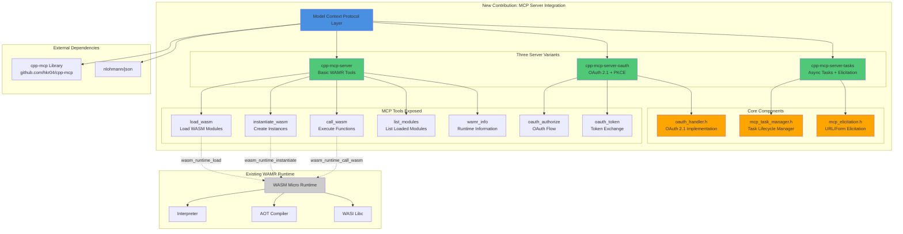

# WAMR MCP Integration - Contribution Overview

## Architecture Diagram



## What Was Added

### 1. **MCP Protocol Layer for WAMR**
Integrated the Model Context Protocol (JSON-RPC 2.0) with WebAssembly Micro Runtime, enabling AI agents to:
- Load and execute WebAssembly modules programmatically
- Manage WASM instances and function calls
- Query runtime information

### 2. **Three Server Variants**

| Server | Purpose | Key Features |
|--------|---------|--------------|
| **cpp-mcp-server** | Basic WAMR operations | Module loading, instantiation, function calls |
| **cpp-mcp-server-oauth** | Authenticated access | OAuth 2.1 with PKCE, scope-based permissions |
| **cpp-mcp-server-tasks** | Async operations | Task lifecycle, URL elicitation for auth flows |

### 3. **Security & Authentication**
- **OAuth 2.1 with PKCE**: RFC 7636 compliant authorization code flow
- **Scope-based access control**: Fine-grained permissions (mcp:tools, mcp:wamr:load, mcp:wamr:execute)
- **Bearer token authentication**: Secure session management
- **URL elicitation**: Out-of-band user interactions for credentials

### 4. **Asynchronous Task Management**
- **Task lifecycle**: working → input_required → completed/failed/cancelled
- **TTL-based cleanup**: Automatic task expiration
- **Cancellation support**: Graceful task termination
- **Session isolation**: Multi-user task management

### 5. **Build Infrastructure**
- **CMake integration**: Builds all three variants with proper WAMR linking
- **Automated build script**: `build_kontest.sh` for Ubuntu 20.04
- **Dependency management**: Handles all build prerequisites

## Files Added

```
samples/cpp-mcp-server/
├── CMakeLists.txt                    # Build configuration
├── README.md                         # Usage documentation
├── MCP_TASKS_ELICITATION.md         # Tasks/Elicitation guide
├── src/
│   ├── main.cpp                     # Basic server
│   ├── main_oauth.cpp               # OAuth-enabled server
│   ├── main_tasks.cpp               # Tasks-enabled server
│   ├── oauth_handler.h              # OAuth 2.1 implementation
│   ├── mcp_task_manager.h           # Task manager
│   └── mcp_elicitation.h            # Elicitation manager
├── include/                         # MCP library headers (from cpp-mcp)
├── src/mcp/                         # MCP implementation (from cpp-mcp)
└── common/                          # JSON library (nlohmann/json)

build_kontest.sh                     # Root-level build script
```

## Integration with Existing WAMR

The contribution **extends** WAMR without modifying core runtime code:

- ✅ Uses existing WAMR APIs (`wasm_runtime_*`)
- ✅ Links against standard WAMR `vmlib`
- ✅ Compatible with WAMR's interpreter and AOT modes
- ✅ Follows WAMR's CMake build patterns
- ✅ Adds new sample in `samples/` directory alongside existing examples

## Technology Stack

| Component | Technology | Purpose |
|-----------|-----------|---------|
| **Protocol** | JSON-RPC 2.0 | MCP communication standard |
| **Transport** | stdio | Standard input/output |
| **Runtime** | WAMR | WebAssembly execution |
| **Auth** | OAuth 2.1 + PKCE | Secure authorization |
| **Language** | C++17 | Implementation language |
| **JSON** | nlohmann/json | JSON parsing/serialization |
| **Build** | CMake | Build system |

## Compliance & Standards

- ✅ **MCP Specification**: 2025-11-25 version
- ✅ **SEP-1686**: Tasks for asynchronous operations
- ✅ **RFC 7636**: PKCE for OAuth 2.1
- ✅ **RFC 6749**: OAuth 2.0 Authorization Framework
- ✅ **JSON-RPC 2.0**: Message protocol

## Usage Example

```bash
# Build everything
./build_kontest.sh

# Run basic server
./product-mini/platforms/linux/build/cpp-mcp-server

# Send MCP request
echo '{"jsonrpc":"2.0","id":1,"method":"tools/list","params":{}}' | ./cpp-mcp-server

# Load a WASM module
echo '{
  "jsonrpc":"2.0",
  "id":2,
  "method":"tools/call",
  "params":{
    "name":"load_wasm",
    "arguments":{
      "module_name":"hello",
      "file_path":"/path/to/hello.wasm"
    }
  }
}' | ./cpp-mcp-server
```

## Impact

This contribution enables:
- 🤖 **AI agents** to control WebAssembly execution
- 🔐 **Secure access** via OAuth 2.1 authentication
- ⚡ **Async operations** for long-running WASM tasks
- 🌐 **Standardized protocol** (MCP) for WASM runtime control
- 🔧 **Easy integration** with existing MCP ecosystems (Claude, VSCode MCP)
